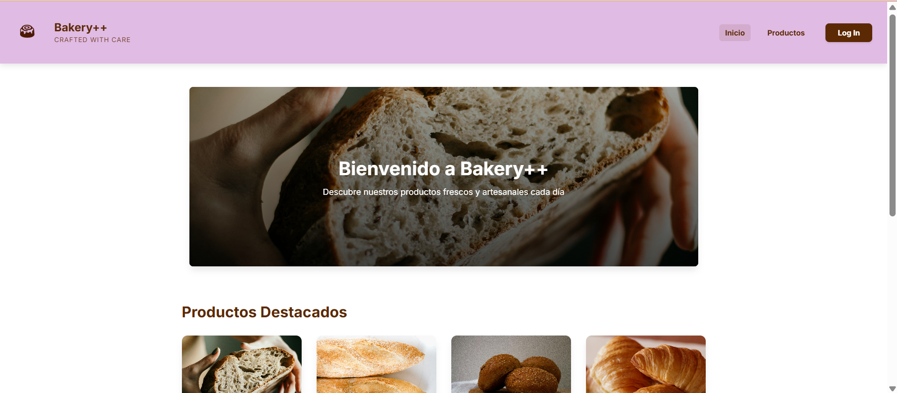
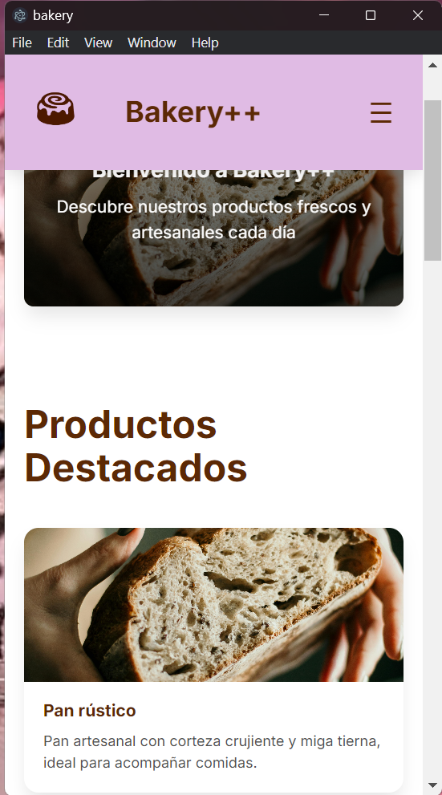

# Bakery++ 🥐
Una aplicación web moderna y funcional para una panadería artesanal, diseñada con un enfoque en la accesibilidad y la mantenibilidad.

---

## 🚀 Despliegue y Acceso

El proyecto ha sido distribuido en múltiples entornos para asegurar su disponibilidad en diferentes plataformas:

- **API Backend**: [din-25-26-zw82.onrender.com](https://din-25-26-zw82.onrender.com/) (Desplegada en **Render**).
- **Frontend Web**: [din-api-mongo-frontend.vercel.app](https://din-api-mongo-frontend.vercel.app/) (Alojado en **Vercel**).
- **App de Escritorio**: Empaquetada con **Electron** (Scripts de empaquetado listos para generar `.exe`).

### 🛠️ Configuración de Entornos
Se ha implementado una gestión robusta de **variables de entorno** (`.env`). Esto permite que la aplicación detecte automáticamente si se encuentra en un entorno de desarrollo o de producción, ajustando las URLs de conexión a la API de forma transparente.

### ⚠️ Desafíos y Soluciones en el Despliegue
Durante el proceso de puesta en producción, se abordaron los siguientes retos técnicos exigidos por la actividad:
1. **Configuración de CORS**: Al separar el Backend y el Frontend en dominios distintos (Render y Vercel), fue necesario ajustar las cabeceras de seguridad en la API para permitir peticiones desde el dominio de producción.
2. **Proxy en Vercel para CORS**: Cuando la aplicación web intenta comunicarse con la API desde Vercel, el navegador bloquea la conexión por razones de seguridad (política CORS). Como la API es externa y no se puede modificar, se configuró Vercel para que actúe como "intermediario": las peticiones pasan primero por Vercel y luego este las reenvía a la API real. De esta forma, el navegador cree que todo ocurre en el mismo sitio y permite la conexión. En local y Electron no hay este problema porque no aplican las mismas restricciones de seguridad.
3. **Enrutamiento en Vercel (SPA)**: Al ser una Single Page Application con React Router, la navegación manual a rutas como `/products` o `/admin` devolvía un error 404 en producción. Se solucionó creando un archivo `vercel.json` con una regla de reescritura que redirige todas las peticiones al `index.html`, permitiendo que React Router gestione las rutas en el cliente.
4. **Persistence en Escritorio**: Al empaquetar con Electron, se optó por cargar la URL de producción directamente para garantizar que los datos estén siempre sincronizados entre la web y el escritorio sin necesidad de redundancia de código.
5. **Variables de Entorno en Vite**: El uso de `VITE_` al inicio de las variables fue clave para que el compilador de Vite pudiera inyectarlas correctamente en el bundle final de producción.
6. **Empaquetado de Electron (.exe)**: Durante el proceso de generación del ejecutable con `electron-builder`, se encontraron limitaciones de permisos en Windows 11 relacionadas con la firma de código (code signing). El sistema requiere privilegios de administrador o activar el "Modo Desarrollador" para crear enlaces simbólicos necesarios en el proceso de empaquetado. Como alternativa funcional, la aplicación de escritorio se ejecuta perfectamente con `npm run electron-dev`, cargando la versión de producción desde Vercel. La carpeta `dist-electron` se ha añadido al `.gitignore` para evitar subir archivos binarios pesados al repositorio.

---

## 🖥️ Web vs Escritorio: Reflexión Técnica

### ¿Qué ventajas tiene el despliegue web frente al de escritorio?
El despliegue web ofrece una **accesibilidad inmediata**, ya que no requiere procesos de descarga ni instalación por parte del usuario. Además, garantiza que todos los usuarios utilicen siempre la **versión más actualizada**, eliminando la necesidad de gestionar parches o actualizaciones manuales. Desde el punto de vista del desarrollo, permite un soporte **multiplataforma real** con un único despliegue.

### ¿Por qué Electron no sustituye a una web?
Aunque Electron permite convertir una web en una app nativa, conlleva un mayor **consumo de recursos del sistema** (memoria RAM y almacenamiento en disco) debido a que incluye una instancia motorizada de Chromium. Su uso se justifica principalmente cuando la aplicación requiere **capacidades que están restringidas en el navegador**, como el acceso directo al sistema de archivos local, integración con hardware específico o notificaciones nativas avanzadas gestionadas por el sistema operativo.

---

## 🎨 Arquitectura y Calidad Técnica (RA 5 & RA 7)

Para asegurar la escalabilidad del proyecto, se han aplicado patrones de diseño que van más allá de una implementación básica:

- **Arquitectura de Servicios Centralizada**: Se ha creado un `apiClient.js` mediante Axios que centraliza la configuración de la API y gestiona automáticamente la inyección del token JWT en las cabeceras de las peticiones protegidas.
- **Abstracción con Hooks Genéricos**: La lógica de los formularios y la gestión de archivos se ha unificado en un hook reutilizable `useForm.js`. Esto reduce la duplicación de código y asegura un comportamiento consistente en Login, Registro y Administración.
- **Optimización de Rendimiento (Code Splitting)**: Se utiliza `React.lazy` y `Suspense` para dividir el código en fragmentos. Esto permite que el navegador solo descargue el código de la página que el usuario está visitando en ese momento.
- **Resiliencia de la Interfaz**: La implementación de un `ErrorBoundary` global evita que un fallo inesperado en un componente provoque el cierre total de la aplicación, ofreciendo siempre una salida segura y amigable al usuario.
- **Estandarización Estética (BEM)**: Todo el sistema de estilos se rige por la metodología BEM, facilitando la lectura del CSS y evitando conflictos de nombres entre diferentes componentes.

---

## ♿ Accesibilidad, Usabilidad y Mejores Prácticas

## 📸 Capturas de Pantalla
Para demostrar el funcionamiento en producción, se adjuntan las siguientes vistas:

### Vista Web (Vercel)


### Vista de Escritorio (Electron - Simulación Móvil)


---

## ♿ Accesibilidad, Usabilidad y Mejores Prácticas

### Accesibilidad (A11y)
- **HTML Semántico**: Uso estructurado de etiquetas como `<main>`, `<section>`, `<header>`, `<article>` y `<figure>`.
- **ARIA y Landmarks**: Implementación de atributos ARIA para facilitar la navegación con lectores de pantalla.
- **Navegación por Teclado**: La aplicación es totalmente operable mediante teclado, incluyendo un enlace de "Saltar al contenido principal".

### Usabilidad (UX/UI)
- **Diseño Responsivo**: Adaptación fluida a diferentes resoluciones bajo un enfoque "mobile-first".
- **Navegación Intuitiva**: Estructura de menús y acciones clara para minimizar la curva de aprendizaje.

---

## 📦 Primeros Pasos

### Instalación
```bash
npm install
```

### Ejecución en Desarrollo
```bash
# Para la versión Web
npm run dev

# Para la versión de Escritorio (Electron)
npm run electron-dev
```

## Créditos
- **Recursos Visuales**: [Pexels](https://pexels.com) y [Freepik](https://freepik.com).
- **Alojamiento de Imágenes**: [ImgBB](https://imgbb.com).