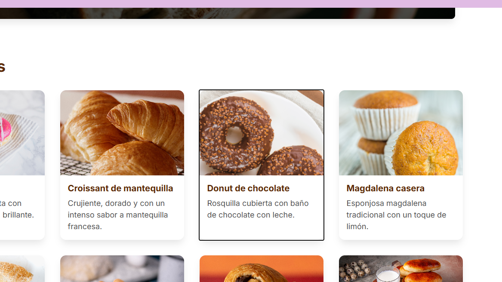
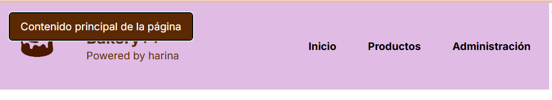

# Bakery++ 🥐
Una aplicación web moderna, accesible para una panadería artesanal.

## Accesibilidad, Usabilidad y Mejores Prácticas

### Accesibilidad (A11y)

- **HTML Semántico**: Uso adecuado de etiquetas HTML5 como `<main>`, `<section>`, `<header>`, `<article>`, y `<figure>` para proporcionar una estructura clara del documento.
- **ARIA y Landmarks**: Uso estratégico de atributos ARIA (`aria-label`, `aria-labelledby`) para ayudar a los lectores de pantalla a navegar por componentes complejos.
- **Navegación por Teclado**: Totalmente navegable mediante el teclado. Incluimos un enlace de "Saltar al contenido principal" para mayor eficiencia.


- **Texto Alt**: Texto alternativo descriptivo para todas las imágenes de productos.


### Usabilidad (UX/UI)
Diseñado pensando en el usuario, centrándose en la claridad, la velocidad y la capacidad de respuesta.

- **Diseño Responsivo**: Enfoque "mobile-first" que garantiza una experiencia premium en computadoras de escritorio, tabletas y teléfonos inteligentes.
- **Navegación Intuitiva**: Jerarquía de información clara y patrones de navegación estandarizados.

### Mejores Prácticas Técnicas
- **Hooks Personalizados**: La lógica de negocio (validación de formularios, búsqueda) está encapsulada en hooks de React reutilizables (`useProductForm`, `useProductSearch`).
- **Componentes Documentados**: Documentación completa en JSDoc y Storybook para cada elemento de la interfaz de usuario.

## Primeros Pasos

### Instalación
```bash
npm install
```

### Desarrollo
```bash
npm run dev
```

## Créditos
- **Imágenes**: [Pexels](https://pexels.com), [Freepik](https://freepik.com)
- **Hosting**: Imágenes alojadas en [ImgBB](https://imgbb.com)