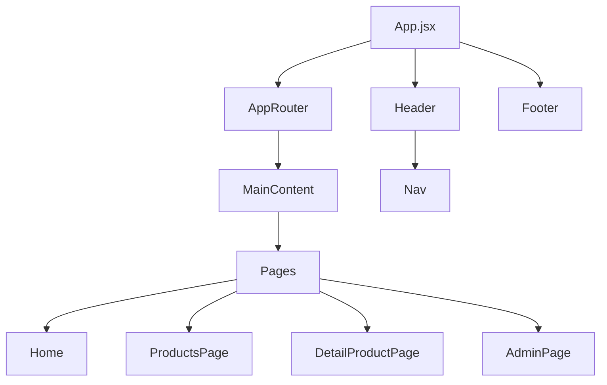

# Architecture

Bakery++ follows a **component-based architecture** with clear separation of concerns and organized folder structure.

## System Overview



## Component Categories

### Layout Components (`components/layout/`)
Structural components that define the application's layout:

| Component | Purpose | Key Props |
|-----------|---------|-----------|
| `Header` | Top navigation bar with logo and menu | - |
| `Footer` | Bottom page footer | - |
| `Nav` | Responsive navigation menu | `links` |
| `MainContent` | Main content wrapper with Outlet | - |
| `Section` | Page section with title | `title`, `children` |

### UI Components (`components/ui/`)
Reusable presentational components:

| Component | Purpose | Key Props |
|-----------|---------|-----------|
| `Card` | Product preview card | `title`, `description`, `image` |
| `Banner` | Hero banner with image | `image`, `title`, `content` |
| `SearchBar` | Search input with icon | `searchTerm`, `onSearchChange` |

### Product Components (`components/products/`)
Domain-specific components for products:

| Component | Purpose | Key Props |
|-----------|---------|-----------|
| `ProductDetail` | Full product information display | `nombre`, `precio`, `categoria`, etc. |
| `ProductForm` | Form for adding products | - |
| `RenderCards` | Maps products to Card components | `items`, `options` |

### Form Components (`components/forms/`)
Reusable form field components:

| Component | Purpose | Key Props |
|-----------|---------|-----------|
| `InputField` | Text/number/url input | `label`, `value`, `onChange`, `error` |
| `TextareaField` | Multi-line text input | `label`, `value`, `onChange`, `error` |
| `SelectField` | Dropdown select | `label`, `value`, `options`, `onChange` |

## Routing Structure

```javascript
/ (MainContent wrapper)
├── /home              → Home page
├── /productos         → Products catalog
├── /productos/:id     → Product detail
└── /anadir-producto   → Admin page (mock auth)
```

## Data Flow

### State Management
- **Local state** with `useState` for component-specific state
- **Props drilling** for passing data down the tree
- **No global state** - simple application doesn't require Redux/Context

### Data Sources
- `src/data/productos.js` - Mock product data
- Future: Could be replaced with API calls

## Design Patterns

### Component Composition
Components are composed hierarchically:
```
App
└── Header
    └── Nav
└── AppRouter
    └── MainContent
        └── Page
            └── Section
                └── Components
└── Footer
```

### Props Pattern
- **Controlled components** for forms
- **Render props** for RenderCards
- **Prop validation** with PropTypes

### File Organization
```
ComponentCategory/
├── Component.jsx        # Component implementation
└── Component.propTypes.js  # PropTypes definitions (when extracted)
```

## Performance Considerations

- **Code splitting** via React Router
- **useMemo** for expensive computations (search filtering)
- **Lazy loading** could be added for images
- **Vite** for fast HMR during development

## Accessibility

- **Semantic HTML** (`<header>`, `<nav>`, `<main>`, `<footer>`)
- **ARIA labels** for interactive elements
- **Skip link** for keyboard navigation
- **Focus management** in modals/menus
- **Alt text** for all images

## Future Enhancements

- API integration for real data
- Authentication system
- Shopping cart functionality
- Admin dashboard with CRUD operations
- Image optimization and lazy loading
- Unit and integration tests
