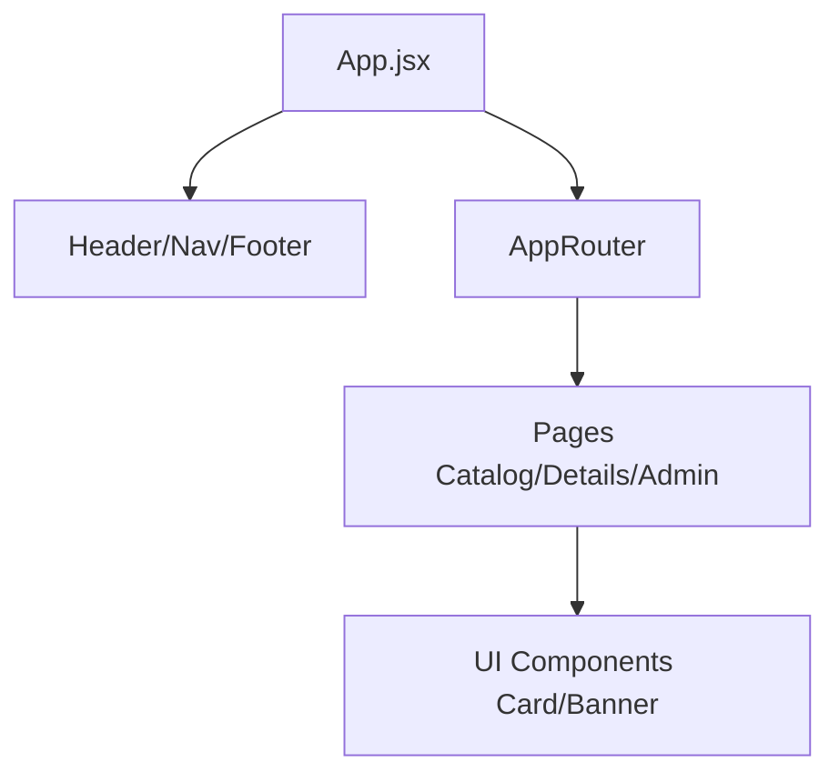

# Architecture

Bakery++ follows a **component-based architecture** with clear separation of concerns and organized folder structure.

## How the App Fits Together

The application is structured like a tree. `App.jsx` is the root, and it uses `AppRouter` to decide which page to show.



## Data Flow: From File to Screen

Understanding how data moves is key to understanding the project:

1. **Data Definition**: All products live in `src/data/productos.js`.
2. **Fetching**: Pages import this data directly. 
3. **Downstream**: The data is passed down to components (like `Card` or `ProductDetail`) via **Props**.
4. **State**: We use `useState` for things that change (like what the user types in the search bar).

## Accessibility Features

We don't just want it to look good; it must be usable by everyone:
- **Semantic HTML**: We use `<header>`, `<main>`, etc., so screen readers know exactly where they are.
- **Skip Link**: A hidden link that appears on TAB focus, letting users jump straight to the content.
- **Logical IDs**: Each section has a clear ID (like `id="products-section"`) used internally for navigation.

## Component Categories

### Layout Components (`components/layout/`)
Structural components that define the application's layout:

| Component | Purpose | Key Props |
|-----------|---------|-----------|
| `Header` | Top navigation bar with logo and menu | - |
| `Footer` | Bottom page footer | - |
| `Nav` | Responsive navigation menu | `links` |
| `MainContent` | Main content wrapper with Outlet | - |
| `Section` | Page section with title and accessible IDs | `title`, `children` |

### UI Components (`components/ui/`)
Reusable presentational components:

| Component | Purpose | Key Props |
|-----------|---------|-----------|
| `Card` | Product preview card | `title`, `description`, `image` |
| `Banner` | Hero banner with image and h2 title | `image`, `title`, `content` |
| `SearchBar` | Search input with icon | `searchTerm`, `onSearchChange` |

### Product Components (`components/products/`)
Domain-specific components for products:

| Component | Purpose | Key Props |
|-----------|---------|-----------|
| `ProductDetail` | Full product information display | `nombre`, `precio`, `categoria`, etc. |
| `ProductForm` | Form for adding products | - |
| `RenderCards` | Maps products to Card components | `items` |

### Form Components (`components/forms/`)
Reusable form field components:

| Component | Purpose | Key Props |
|-----------|---------|-----------|
| `InputField` | Text/number/url input | `label`, `value`, `onChange`, `error` |
| `TextareaField` | Multi-line text input | `label`, `value`, `onChange`, `error` |
| `SelectField` | Dropdown select | `label`, `value`, `options`, `onChange` |

## Routing Structure

```javascript
/ (MainContent wrapper)
├── /home              → Home page
├── /productos         → Products catalog
├── /productos/:id     → Product detail
└── /anadir-producto   → Admin page (mock auth)
```

## Data Flow

### State Management
- **Local state**: We use `useState` for simple component logic.
- **Props**: Data is passed from parent to children components.
- No complex global state (Redux/Context) is needed for this project.

### Data Storage
- Products are stored in `src/data/productos.js` as a static array.

## Accessibility Features

We prioritize making the site usable for everyone:
- **Semantic HTML**: Using tags like `<header>`, `<main>`, and `<footer>`.
- **Keyboard Friendly**: Clear focus rings and a "Skip to Content" link.
- **Screen Readers**: Descriptive ARIA labels and alt text for all images.
- **Dynamic IDs**: Logical IDs for sections to help navigation.
